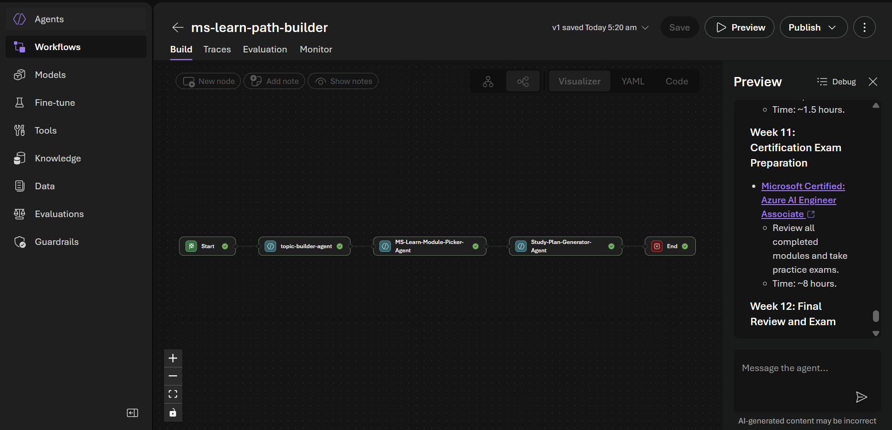
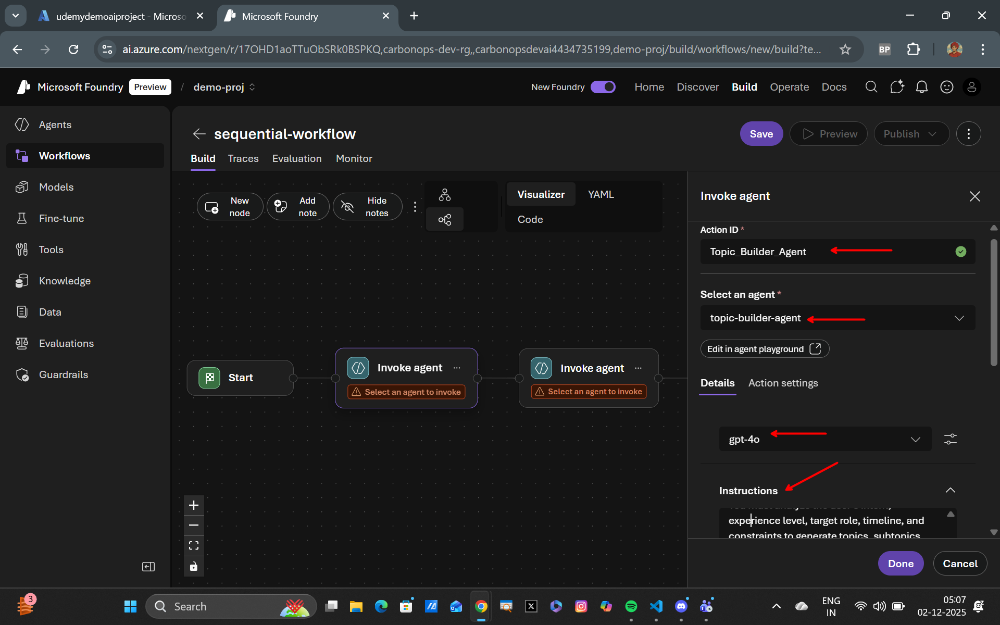
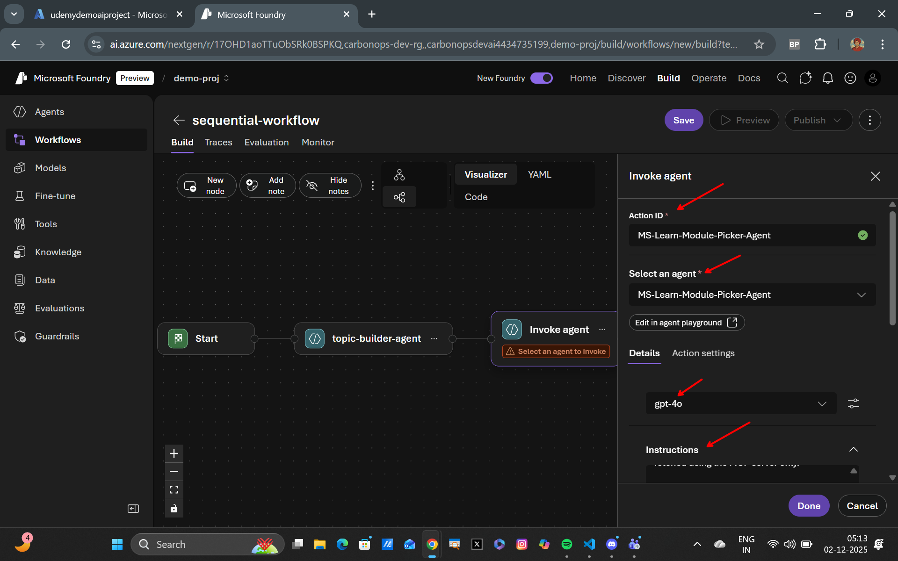
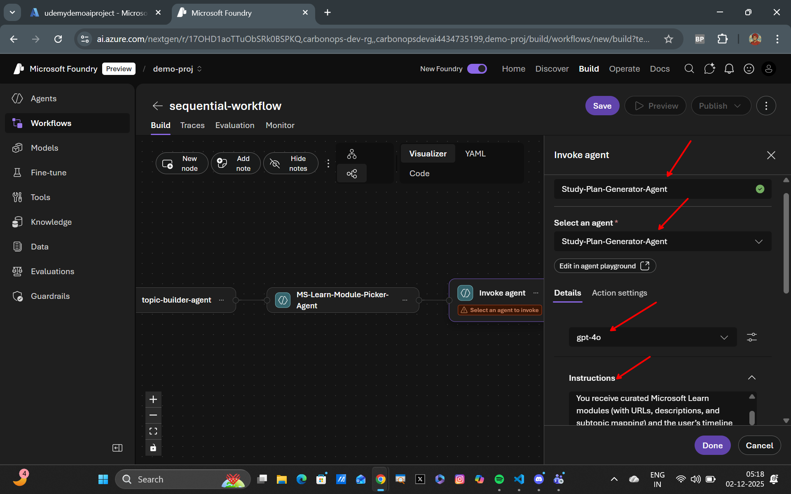
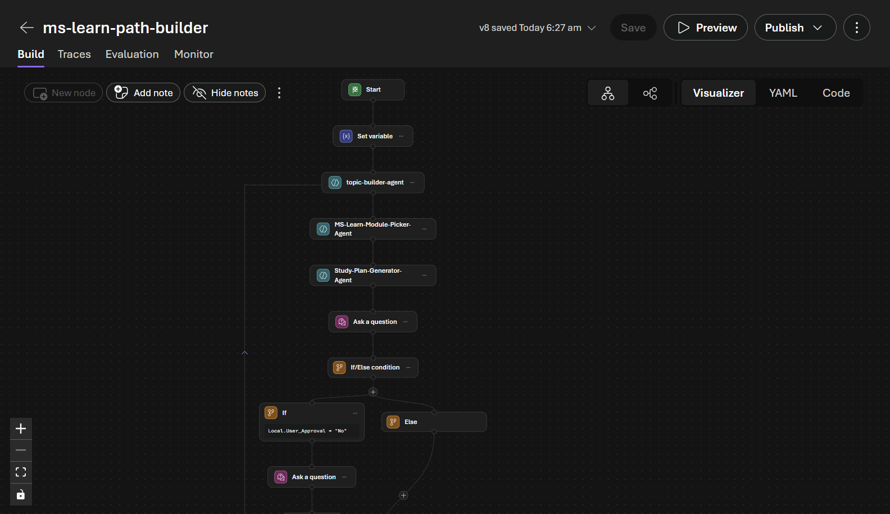

## Building a MS Learn Path Builder with Foundry Sequential Workflow


# Overview
In this tutorial, we will build a Multi-Agent System (MS) Learn Path Builder using Foundry's Sequential Workflow capabilities. The MS Learn Path Builder will help users create personalized learning paths by leveraging multiple agents that specialize in different areas of knowledge.

# Step 1: Build the Topics Builder Agent
Name your first agent as `Topic-Builder-Agent`.

Create the Topic Builder Agent that will generate a list of topics based on user input. This agent will use a language model to understand the user's learning goals and suggest relevant topics with the following system prompt

```markdown
You are the Topic Builder Agent, the first step in a sequential workflow that generates a personalized learning roadmap based on a user’s goals.

Your task is to take the user's learning goals and produce a structured, actionable set of foundational outputs that will be used by subsequent workflow steps.
You must analyze the user’s intent, experience level, target role, timeline, and constraints to generate topics, subtopics, relevant technologies, and prerequisite skills required to achieve the learning objective. The topics generated should be aligned with Microsoft Tech Stack and MS Learn modules. You work is to only generate topics and nothing else to pass onto the ms learn module picker agent.

The output format should be as follows:
User Goal: Summary of the user’s learning goal.
Topics:
- Topic 1
  - Subtopic 1.1
  - Subtopic 1.2
```


---

### Step 2: Build the Learning Module Picker Agent
Name your second agent as `MS-Learn-Module-Picker-Agent`.

Create the MS Learn Module Picker Agent that will select appropriate Microsoft Learn modules based on the topics generated by the Topic Builder Agent with the Web Search Tool attached to it as a tool. This agent will use a language model to match topics with relevant learning modules using the following system prompt

```markdown
You are the MS Learn Module Picker Agent, the second step in a sequential workflow that builds a personalized Microsoft Learn study path.

You receive structured topics generated by the Topic Builder Agent.
Your job is to map each topic and subtopic to the most relevant Microsoft Learn modules, learning paths, and units available in the Microsoft Learn catalog.

You are NOT allowed to hallucinate URLs or make up module names.
All Microsoft Learn content MUST be fetched using up-to-date data from the Web Search tool provided to you.

Return a structured list of topics with their corresponding Microsoft Learn modules, including module names, URLs, and brief descriptions.
```


---

Attach the Web Search Tool to the `MS-Learn-Module-Picker-Agent`.

### Step 3: Build the Study Plan Generator Agent
Name your third agent as `Study-Plan-Generator-Agent`.

Create the Study Plan Generator Agent that will compile the selected Microsoft Learn modules into a comprehensive study plan. This agent will use a language model to organize the modules into a structured learning path with timelines and milestones using the following system prompt

```markdown
You are the Study Plan Generator Agent, the third step in a sequential workflow.

You receive curated Microsoft Learn modules (with URLs, descriptions, and subtopic mapping) and the user’s timeline information.
Your job is to convert these modules into a structured, realistic, and achievable week-by-week study plan, factoring in the user’s available time, pace, module complexity, and learning depth.

Your output MUST be clean, human friendly.
```


---

### Step 4: Try it Out
Now that you have built all three agents, it's time to test the MS Learn Path Builder workflow.

Here are a couple of example prompts you can use to see how the workflow performs:
```markdown
1) I want to become an Azure AI Engineer in 3 months.
I know basic Python and I’ve used Azure VMs before but that’s it.
I can study around 8–10 hours every week.

2) Help me learn data engineering from scratch using Microsoft Learn.
I want to get comfortable with pipelines, Azure Data Factory, Delta Lake, and Databricks.
My background is mechanical engineering, and I can give 6 hours per week.

3) I want to switch careers into cybersecurity and become a SOC Analyst.
I don’t have coding experience.
I have 10 weeks until I want to start applying for jobs.
Build me a strong path.
```

### Next Steps
You can further enhance the MS Learn Path Builder by adding more workflow tools and loops like one in the image below:

